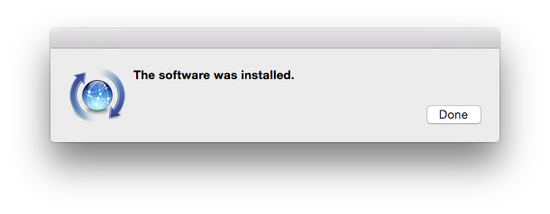
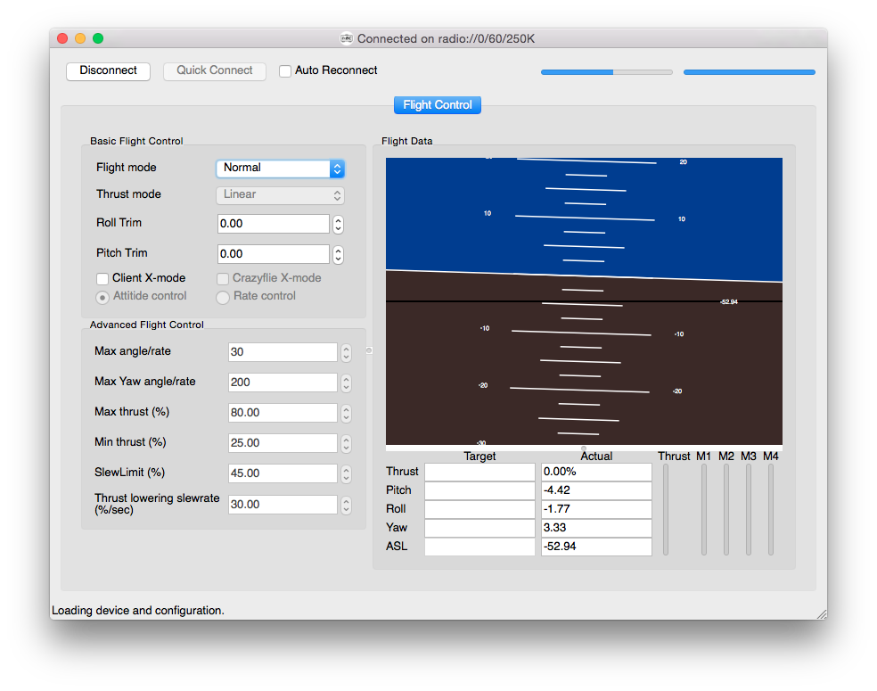
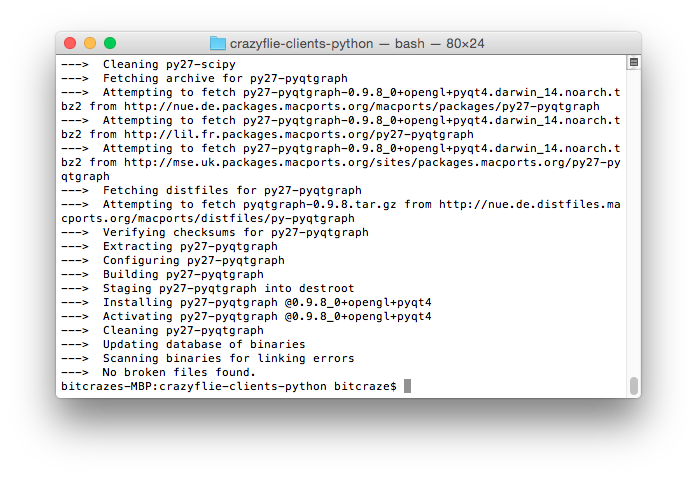
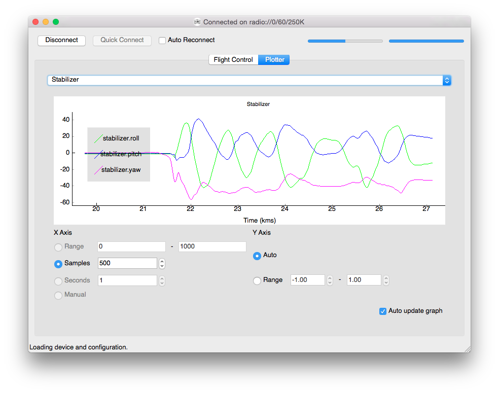

Installing Crazyflie client with macPorts
=========================================

This procedure has been tested on a just-installed Yosemite
installation. Commands in code blocks have to be executed in a terminal
window.

Prerequisite
------------

Download and install macport installer from
<https://www.macports.org/install.php>

Install the command line developer tools:

    xcode-select --install

I found that installing only the command line developer tools is enough
for Crazyflie client dependencies. However installing Xcode seems to be
recommended. I installed the command line developer tools:

Update mac ports

    sudo port selfupdate

Update already installed ports (none on a fresh installation)

    sudo port upgrade outdated

Mandatory dependencies
----------------------

Install Crazyflie client dependencies

    sudo port install libusb python27 py27-pyusb py27-SDL2 py27-pyqt4

Most but not all packages are pre-compiled so this installation takes
some time. It took about 12 minutes for me, YMMV.

Now you are able to clone and run the Crazyflie client!

    cd Documents
    git clone https://github.com/bitcraze/crazyflie-clients-python
    cd crazyflie-clients-python
    /opt/local/bin/python2.7 bin/cfclient

Optional dependencies
---------------------

If you want to use the plotter tab, to graph in real time Crazyflie log
variables, you need to install pyqtgraph. It installs a lot of
dependencies and took about 5 minutes (The ports install time varies a
lot depending on how many ports are pre-compiled):

    sudo port install py27-pyqtgraph

You can now access the plotter tab:

    /opt/local/bin/python2.7 bin/cfclient

Troubleshooting
---------------
